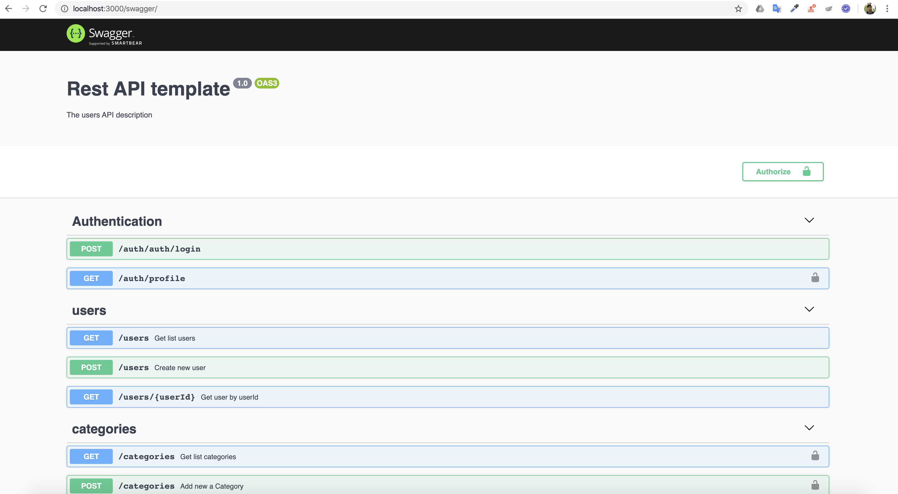

# Restful API Template



## Getting started

This is an example assignment while applying to development at VFA.

## Table of contents:

- [Pre-requirement](#pre-requirement)
- [Installtion](#installation)
- [Install](./docs/INSTALL.md#Install)
- [Starting server](#starting-server)
- [Coding](#coding)
- [Testing](#testing)
- [Features](#Features)
- [Checklists](#checklists)
- [Structure](#features)

# Pre-requirements

To build and run this app locally you will need a few things:

- Install [Docker](https://www.docker.com/). Required version Docker engine >= `17.09.0+`. We used some features of docker-compose version `v3.4`

* Install [VS Code](https://code.visualstudio.com/)

# Installation

- Clone the repository

```
git clone --depth=1 <link-repo> <project_name>
```

- Install dependencies

```
$ cd <project_name>
$ yarn
```

- Adds the source line to your profile (~/.bash_profile, ~/.zshrc, ~/.profile, or ~/.bashrc). If you run application in docker, ENV in docker will got from here.

```bash

export NODE_ENV="local"
export DB_HOST="0.0.0.0"
export DB_ROOT_PASSWORD="admin@123"
export DB_DATABASE="db_template"
export DB_USERNAME="devUser"
export DB_PASSWORD="123456"

```

- Create file `.env` in your project's directory root. Your Nodejs Application will get ENV from this file.
  After that. change content in this file with value coresponding above step.

```bash
$ cp .env.example .env
```

# Starting server

## Docker environment production.

- Run your application in mode develop

```bash
$ yarn run start-docker
```

- Check from your browser. Default port is 3000

```sh
http://localhost:3000/graphql
```

## Running in mode development

**Keeping your Hot Code Reloading**

- A better way to develop this source with docker. When you run project in this mode, any file in directory `src/*` change. waiting a few seconds, Server nodejs will be restart.

```bash
$ yarn run start-local-docker
```

## Coding

Small example about module category, both test e2e and unit test. Please have a look. [Example](./docs/Example.md).

## Testing

- **This repository use [Jest](https://jestjs.io/docs/en/getting-started.html)**.

For run test case unit test.

```bash
$ yarn run test
```

- For run test case e2e test. Make sure that server had started before.

```bash
$ yarn run test:e2e
```

## Features

1. MVC architecture.
2. RESTful API
3. E2E testing
4. AWS Intergration
5. Background processing task
6. Multi database
7. Typescript
8. Nodejs with Nestjs Framework

## Checklists

- [x] 1. Building the base project by MVC architecture.
- [x] 2. RESTful API support
- [x] 3. Authorization by API key use [PasspostJs](http://www.passportjs.org/docs/oauth/)
- [x] 4. Authentication by access key
- [x] 5. E2E testing for RESTful
- [x] 6. Logging in file
- [x] 7. Auto check syntax and convention rules
- [x] 8. Implementing automated build, test and deploy to CircleCI
- [x] 9. Swagger UI
- [x] 10. Migation MYSQL
